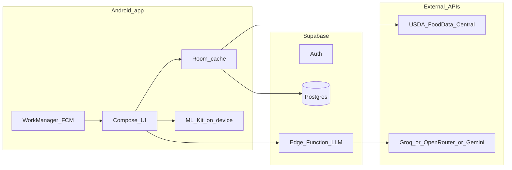

# Personal grocery-to-meal planner (Android + cloud)

## Goals (from your brief)

- Ingest **grocery cart / receipt** (photo or manual) → structured **line items**, **prices**, and **quantities**.
- Plan **meals** from what you bought (+ **pantry staples**), with **servings**, **macros/micros per serving** (as data allows), and **effective cost per serving**.
- **Storage guidance** (freezer vs fridge vs pantry) and **spoilage reminders** to cut waste.
- **Pantry inventory** for spices/basics, **mark empty** → rolls into **next trip reminders**.
- **Android-first** (camera/screenshots, notifications).
- **Allergies** always enforced: fish, melon, avocado, grapes (incl. wine), peanuts — extendable in settings.
- **LLM as a mode**, using a **cheap cloud API**; keep costs down with caching, short prompts, and user confirmation for anything safety-related.

### Current focus (explicit)

Ship features that help **you** first: fast receipt/cart capture, trustworthy inventory and cost/nutrition views, spoilage nudges, pantry par reminders, and allergy-safe suggestions. Avoid scope creep into **automated purchasing** or **live deal aggregation across chains** until there is a legal, reliable data path (see below).

## Full “closed loop”: checkout, deals, and API reality

A maximal **closed loop** would include discovering deals, filling a cart, and **placing the order** from the app. In practice:

- **Major grocers and delivery marketplaces** (including Instacart-like models) mostly keep **checkout inside their own apps**; public APIs are rare, change often, or are partner-only. Scraping or unofficial automation is **fragile, ToS-risky, and poor UX** when it breaks.
- **Personalized promotions** are similarly locked in retailer ecosystems; there is no stable, user-authorized way to read “your” offers across stores without official integration.

**Implication for this plan:** v1–v2 treat the **purchase boundary** as **user-mediated**: photo/PDF receipt, manual line items, optional paste from a cart summary, or a **“I shopped at X”** metadata tag. The app excels **after** money changes hands (and helps **before** the next trip via pantry + reminders).

**Later options if you revisit automation:** retailer **affiliate/deep links** (handoff to their app), **OAuth/partner APIs** if you ever get access, **shared grocery lists** export, or a separate **browser helper** (extension/desktop) scoped to your own use—each is a product/legal decision, not an MVP requirement.

## Architecture (high level)

**Why Supabase (fits your choices):** Postgres + Auth map cleanly to relational shopping trips, line items, pantry, recipes, and meal plans; **Row Level Security** keeps each user’s rows private; **Edge Functions** can hold the LLM provider secret so it is **not embedded in the APK**. **Supabase Storage is optional** for v1 (receipt bitmaps are not kept); add Storage later only if some other feature needs blobs (e.g. recipe photos). Firebase is equally viable if you prefer Google-all-in; the same patterns apply (Firestore + Cloud Functions).

**Offline-first:** Treat **Room** as the primary UI data source; sync up/down with Supabase (WorkManager). Conflicts for a single-user account are rare; **last-write-wins** or **server timestamp** is enough for v1.

### Local vs Supabase: storage size vs other reasons

**Raw storage need (personal use):** Structured data (trips, line items, recipes, pantry, cached nutrients, **plus persisted OCR plaintext**) stays small—on the order of **tens of MB** even with years of history. Receipt **bitmaps are intentionally discarded** after processing, so they do not accumulate on disk or in the cloud. So **off-device storage is not usually required because the phone “runs out of space”** for this app alone.

**Why Supabase still makes sense (beyond bytes):**

- **Backup and device loss:** Cloud **row data** (trips, lines, pantry, etc.) gives **recoverability** without you managing manual exports—**without** needing to back up receipt photos.
- **Multi-device / reinstall:** Same account on a new phone or tablet without ad-hoc backup restores.
- **LLM API keys:** **Edge Functions + secrets** avoid shipping provider keys in the client—this is a **security and product** reason, not a capacity reason.
- **Commercial path:** Auth, **RLS**, and per-user isolation are already the right shape if you ever ship broadly.
- **Optional:** Push-adjacent jobs (e.g. scheduled digest) or server-side aggregation later—still not about local disk quota.

**If you ever wanted minimal cloud:** Room-only + periodic **export file** works for a single device; you would still want **some** server for LLM proxy unless you accept **bring-your-own-key** on device (worse for a public APK) or no LLM. The adopted default is already hybrid-friendly: **Room primary**, sync **structured data + OCR text**, **no receipt image upload**.

## Core domain model (tables / entities)

- **`shopping_trips`**: store, date, source (`receipt_photo`, `manual`, `online_cart`), totals, currency; **`ocr_plaintext`** (full on-device OCR output string for revisiting what was read—optional separate **`ocr_plaintext_pre_verify`** only if you want diff/audit without keeping the bitmap).
- **`line_items`**: raw name, quantity, unit, paid price, optional link to a **canonical food** record.
- **`foods`**: normalized name, default storage class, typical shelf life hints, allergen flags, optional **FDC ID** (USDA).
- **`nutrient_cache`**: FDC ID → per 100g nutrient facts (fetched once, refreshed occasionally).
- **`recipes`**, **`recipe_ingredients`**, **`recipe_steps`** (optional): your meals; ingredients reference `foods` or free text with mapping. Add provenance fields when you widen sourcing (see **Recipe sourcing**): e.g. `source_type` (`user_manual`, `imported_url`, `licensed_api`, `llm_draft`), `source_url`, `attribution`, `license_note`.
- **`meal_plan_entries`**: date, meal slot, recipe, scaling factor → drives **total servings** and shopping depletion.
- **`pantry_items`**: staple flag, par level, current estimate, last restocked, “empty” toggle.
- **`user_diet`**: allergy list + dislikes (future); used everywhere.

**Allergy enforcement (v1):** maintain a **structured allergen tag set** on `foods` and `recipes` (e.g. `FISH`, `PEANUT`, `GRAPE`, `AVOCADO`, `MELON`). For **grapes**, also tag **wine**, **raisins**, **vinegar (wine)** if you want strictness — make this configurable. LLM outputs must be **post-validated**: if a suggestion includes a blocked tag, discard and regenerate once, then fall back to “no safe suggestion — here’s your inventory list”.

## Receipt and cart ingestion

**Principle:** **Bitmaps are ephemeral; text and structure are durable.** You do not need to reopen the photo later—only the **extracted text** and **user-verified line items**.

1. **Capture:** camera or image picker; image lives in **memory/temp** only for the duration of the flow.
2. **OCR:** **Google ML Kit Text Recognition** on-device (no third-party image upload for OCR, low cost, works offline). Persist **`ocr_plaintext`** on the trip record so you can **revisit what was read** (e.g. troubleshoot a bad parse or compare to the finalized lines).
3. **Parse (heuristic):** run layout/regex heuristics to propose line items (supermarket receipts are messy).
4. **Verification (required gate):** a **Review & confirm** screen before the trip is saved: edit names, merge/split lines, fix prices/quantities, delete junk lines. User explicitly **confirms** (“Looks good”) to commit. No commit without confirmation—reduces silent OCR errors poisoning cost/nutrition downstream.
5. **Commit:** write **`line_items`** + finalized trip metadata; **delete** the in-memory/temp bitmap and any local cache of the full image. **Do not upload** receipt images to Supabase Storage in v1.
6. **Cancel / abandon:** discard image and any draft; no long-term retention.
7. **Online cart:** optional paste or CSV; same `line_items` pipeline (verification still useful if pasted text is messy).

**Matching line items → foods:** fuzzy string match + user pick from suggestions; store the mapping so the next trip auto-links.

**Optional later:** if you ever add “re-run OCR,” it implies a **new capture** (new ephemeral image), not resurrecting old photos from cloud.

## Nutrition per serving

- **Primary source:** [USDA FoodData Central](https://fdc.nal.usda.gov/) (free API key; rate limits — cache aggressively in `nutrient_cache`).
- **Serving math:** convert purchased units to grams/ml where possible; for recipe servings, scale ingredient grams by recipe yield.
- **Honest limitations:** generic store brands and deli items may not map cleanly — UI should show **confidence** and allow **manual nutrition override** per food.

## Cost per serving

- Allocate **trip line-item cost** to recipes that consume that food using a simple, explainable rule for v1:
  - **FIFO by purchase date** for the same food, or
  - **Average cost** across open “lots” of that food.
- Store **cost basis** on a `ingredient_lots` table (optional v1.5) for accuracy when you buy the same item at different prices.

Reports: for each planned meal or day, sum nutrient contributions and cost allocations; show a **breakdown** (which ingredients drove protein, which drove cost).

## Storage, freezer, and spoilage reminders

- **`foods.storage_class`:** `FREEZER_OK`, `REFRIGERATE`, `PANTRY`, `COUNTER` (examples).
- **`foods.shelf_life_days_refrigerated`** (defaults from a bundled seed table; user overrides per item instance).
- On adding a trip, create **`inventory_lots`** with `opened_at`, `use_by_estimate`, `frozen_at` (nullable).
- **Notifications:** `WorkManager` for local scheduling; **FCM** from Supabase (scheduled edge job) only if you need reliability when the app is killed — start local-only, add FCM if you notice misses.
- UI: “**Use soon**” list sorted by `use_by_estimate`.

## Pantry staples and shopping reminders

- `pantry_items` with **`par_quantity`** and **`is_empty`**.
- **Shopping trip draft:** aggregate empty/low staples + recurring needs.
- Optional **widget** or notification **day before** your typical shopping day (user setting).

## Recipe sourcing (considerations and options)

Recipes are not fungible: **where they come from** drives **law**, **trust**, **allergy safety**, and whether **cost-per-serving** and **nutrition-per-serving** stay honest.

### Legal and ethical

- **Scraping arbitrary recipe sites** (even “for personal use” in a public app) is **high ToS/copyright risk**; layout and selection can be protected; **full-text republication** without a license is the worst case. Prefer **licensed APIs**, **explicit permission**, or **user-supplied** content.
- **Link-out only:** store **title + URL + your notes**; open the source in the browser for cooking. Lowest legal surface; weakest integration (harder to drive structured nutrition/cost from ingredients unless user transcribes).
- **Licensed catalogs:** e.g. **Spoonacular**, **Edamam**, **TheMealDB** (varies by endpoint)—**paid tiers**, attribution rules, and **redistribution limits** apply. Good for a commercial product if you budget API spend and cache per their terms.
- **Public domain / open-licensed** corpora (rare, often low quality or tiny) or **your own** recipes—cleanest.
- **LLM-generated “recipes”** are **not sourced** in a copyright sense but carry **food-safety and allergy** risk; treat as **drafts** until the user saves and you run **deterministic allergen checks**.

### Data quality and your product goals

- **Structured ingredients** (qty, unit, food link) are required for **inventory match**, **cost allocation**, and **FDC mapping**. Whatever the source, expect a **normalization/editing** step (same as receipt verification).
- **Yields and servings** must be explicit; otherwise per-serving metrics drift.
- **URLs rot**; if you cache full text, plan for **broken link** UX and **last-fetched** metadata.

### Allergies and trust

- Every sourced recipe should flow through the same **`foods` / recipe allergen tags** pipeline. **Imported** recipes may **under-declare** allergens—default stance: **ingredient-driven inference** + **prominent “verify for your allergies”** copy; block if any mapped ingredient hits a user blocklist.
- **Fish / melon / avocado / grapes (incl. wine) / peanuts:** maintain **synonym lists** (e.g. tahini vs peanut, wine vinegar, fish sauce) for matching, not just literal words.

### Practical sourcing ladder (aligned with this plan)

1. **MVP / personal:** **Manual entry** (and photos of your own cards—optional OCR assist with user verification, like receipts). **Share-sheet “paste ingredients”** or import a **small JSON/CSV** you control.
2. **Semi-automated personal:** user pastes a **URL**; app stores **metadata + link** only, or you build a **permitted** import path (e.g. only sites you have rights to, or only extract ingredients user confirms).
3. **Productized:** **paid recipe API** with caching and attribution fields in `recipes`.
4. **LLM mode:** proposes **combinations** or **draft steps** from inventory; **never** the sole allergy authority; user **saves as recipe** after review.

### What to store in the schema (when you go beyond manual)

- **`source_type`**, **`source_url`**, **`attribution`**, **`license_note`**, **`fetched_at`** so you can audit, attribute, and delete if required.

## LLM interaction mode (cheap API)

- **Provider:** Groq (fast, often generous free tier), OpenRouter (model choice), or Gemini — pick one; abstract behind an interface.
- **Security:** Android app calls **Supabase Edge Function** with user JWT; function reads **provider API key** from Supabase secrets; returns structured JSON (not free-form markdown only) — e.g. `{ suggested_recipes: [...], warnings: [...] }`.
- **Cost control:** send **compact inventory** (IDs + names + quantities), **allergy list**, **nutrient goals** optional; cap tokens; cache identical prompts.
- **Safety:** LLM is **advisory**; allergy checks are **deterministic** in code. Never trust prose alone.

## Android stack (recommended)

- Kotlin, **Jetpack Compose**, **Navigation**, **Hilt**, **Room**, **DataStore** (preferences), **WorkManager**, **Coil** (images), **ML Kit**.
- **Supabase Kotlin** client for Auth, PostgREST, Functions (add **Storage** only if a non-receipt blob feature needs it).
- **Material 3** UI: trips, line-item editor, recipe builder, meal planner, reports, pantry, settings (allergies).

## MVP milestones

1. **M1 — Inventory foundation:** Room + Supabase sync; manual foods/recipes; pantry; allergy filtering on recipe browse.
2. **M2 — Receipts:** ML Kit OCR + **required** verification gate + persisted `ocr_plaintext`; trip totals; link to foods; ephemeral images only.
3. **M3 — Nutrition + cost reports:** FDC integration + caching; per-serving report screens.
4. **M4 — Spoilage + reminders:** storage defaults; use-by estimates; local notifications.
5. **M5 — LLM mode:** Edge Function + structured meal suggestions with validator.

## Privacy and scope notes

- **Receipt images:** default policy is **no long-term storage** (device or cloud); only **OCR text and structured rows** sync. If you ever offer optional cloud image backup for a commercial audience, make it **opt-in** with explicit consent.
- Enable **export/delete all** for GDPR-style hygiene even if personal.
- “Fish” allergy: clarify in settings whether **shellfish** must be included (many people treat separately). Default v1 can **tag shellfish distinctly** so you can toggle.

## What is not in MVP (defer)

- **Unrestricted** recipe import from arbitrary websites — see **Recipe sourcing**; **manual entry (and user-confirmed paste)** first.
- Skipping the **human verification** step for receipt-derived trips (OCR always needs the gate).
- On-device LLM (possible later; heavy on mobile).
- **Automated checkout** or **scraping retailer carts/deals** — blocked on official APIs or explicit partnerships; not required for a useful personal loop.

---

## Appendix: Commercial release (keep in mind, not current priority)

Use this when you want the same codebase to serve **strangers**, not just your account. The technical choices already help: **Supabase Auth**, **RLS per user**, and **Edge Function** for LLM keys. **Recipe licensing** becomes critical—prefer **user-created**, **licensed APIs**, or **link-out**; see **Recipe sourcing**.

### Positioning wedge (vs. generic meal apps)

Lead with the **integrated workflow** you own: **purchase truth** (receipt/cart → line items → costs) → **inventory + spoilage** → **allergy-safe meal suggestions** with **deterministic guardrails**, plus **pantry par → next trip**. That bundle is easier to explain than “another AI recipe app.”

### Product and trust requirements for general users

- **Allergies / medical:** prominent **disclaimers**; treat suggestions as **informational**; default to **blocking** when validation fails; log what was filtered for support.
- **Nutrition and cost:** show **confidence** and **manual override**; never imply medical diagnosis or exact macro precision.
- **Receipt data:** clear **privacy policy**, **export**, **delete account**; **default zero retention of receipt images** aligns messaging with implementation (text + rows only).
- **OCR:** expect **format diversity** and support load—invest in the **correction UX** and maybe store-level templates over time.

### Engineering hardening beyond “personal dogfood”

- **Observability:** crash reporting, basic analytics (privacy-preserving), rate limits on Edge Functions.
- **Abuse:** caps on LLM calls per user/day; storage quotas; signup friction if needed.
- **App store compliance:** photo/camera justification, data safety form, optional age/content notes.

### Monetization (optional paths, pick later)

- **Freemium:** free core inventory + receipts; pay for LLM quota, multi-household, or advanced reports.
- **Subscription:** modest monthly for sync + LLM + waste insights.
- **B2B2C** (long shot): retailer wants your **engagement** layer—only if their API team is at the table.

### Deals and “shopping” features without closed APIs

For a public product, **manual or semi-manual** often wins: user snaps **sale flyer** or enters **sale price** on a line item; the app computes **cost per serving vs. baseline**. Aggregating chain-wide deals at scale without partnerships tends to be **low ROI** compared to nailing inventory + waste + meals.

### When to revisit true checkout integration

Re-evaluate only if you have **written API access**, **affiliate/partner agreement**, or a **single-chain** pilot where automation is explicitly allowed. Until then, **deep links and handoff** keep you legal and maintainable.
